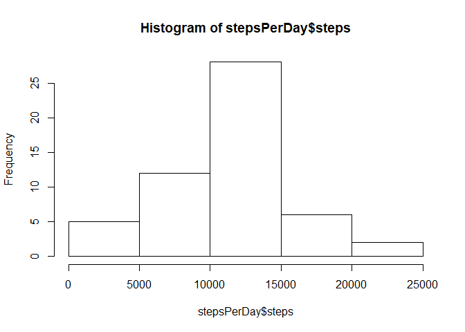
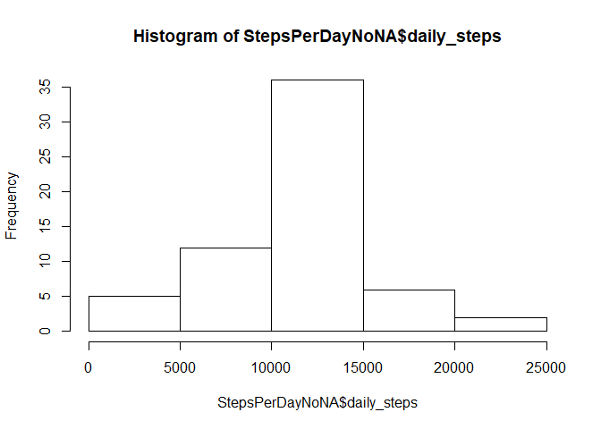
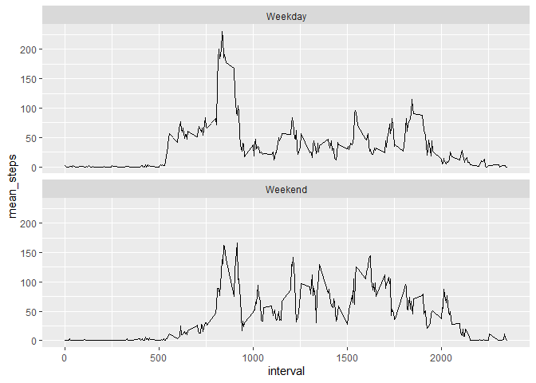

## Loading and preprocessing the data

Reading the csv file in the current directory


```r
df <- read.csv('activity.csv')
```

Taking a look at the dataset


```r
head(df)
```

```
##   steps       date interval
## 1    NA 2012-10-01        0
## 2    NA 2012-10-01        5
## 3    NA 2012-10-01       10
## 4    NA 2012-10-01       15
## 5    NA 2012-10-01       20
## 6    NA 2012-10-01       25
```

```r
str(df)
```

```
## 'data.frame':	17568 obs. of  3 variables:
##  $ steps   : int  NA NA NA NA NA NA NA NA NA NA ...
##  $ date    : Factor w/ 61 levels "2012-10-01","2012-10-02",..: 1 1 1 1 1 1 1 1 1 1 ...
##  $ interval: int  0 5 10 15 20 25 30 35 40 45 ...
```

```r
summary(df)
```

```
##      steps                date          interval     
##  Min.   :  0.00   2012-10-01:  288   Min.   :   0.0  
##  1st Qu.:  0.00   2012-10-02:  288   1st Qu.: 588.8  
##  Median :  0.00   2012-10-03:  288   Median :1177.5  
##  Mean   : 37.38   2012-10-04:  288   Mean   :1177.5  
##  3rd Qu.: 12.00   2012-10-05:  288   3rd Qu.:1766.2  
##  Max.   :806.00   2012-10-06:  288   Max.   :2355.0  
##  NA's   :2304     (Other)   :15840
```


## What is mean total number of steps taken per day?

1. Calculate the number of steps taken per day


```r
#Calculate the number of steps taken per day

stepsPerDay <- aggregate(steps ~ date, df, sum, na.rm=TRUE)

head(stepsPerDay)
```

```
##         date steps
## 1 2012-10-02   126
## 2 2012-10-03 11352
## 3 2012-10-04 12116
## 4 2012-10-05 13294
## 5 2012-10-06 15420
## 6 2012-10-07 11015
```

2. If you do not understand the difference between a histogram and a barplot, research the difference between them. Make a histogram of the total number of steps taken each day


```r
hist(stepsPerDay$steps)
```

<!-- -->

3. Calculate and report the mean and median of the total number of steps taken per day


```r
meanStepsPerDay <- mean(stepsPerDay$steps)

medianStepsPerDay <- median(stepsPerDay$steps)
```

- The mean of the total numver of steps taken per day is 1.0766189\times 10^{4}  
- The mean of the total numver of steps taken per day is 10765  

## What is the average daily activity pattern?

1. Make a time series plot (type = "l") of the 5-minute interval (x-axis) and the average number of steps taken, averaged across all days (y-axis)


```r
stepsPerInterval <- aggregate(steps ~ interval, df, mean, na.rm = T)
plot(steps ~ interval, data = stepsPerInterval, type = "l")
```

<!-- -->

2. Which 5-minute interval, on average across all the days in the dataset, contains the maximum number of steps?


```r
max_interval_by_step <- max(stepsPerInterval$steps)
```

The interval with the maximum number of steps on average is 206.1698113.

## Imputing missing values

Note that there are a number of days/intervals where there are missing values (coded as NA). The presence of missing days may introduce bias into some calculations or summaries of the data.

1. Calculate and report the total number of missing values in the dataset (i.e. the total number of rows with NAs)


```r
totalMissingValues <- sum(is.na(df))
```

There are 2304 missing values in the dataset

2. Devise a strategy for filling in all of the missing values in the dataset. The strategy does not need to be sophisticated. For example, you could use the mean/median for that day, or the mean for that 5-minute interval, etc.

- Let's use the mean for the 5-minute interval to fill the missing values. For that, I'll use the dplyr package


```r
library(dplyr)
```

```
## 
## Attaching package: 'dplyr'
```

```
## The following objects are masked from 'package:stats':
## 
##     filter, lag
```

```
## The following objects are masked from 'package:base':
## 
##     intersect, setdiff, setequal, union
```


3. Create a new dataset that is equal to the original dataset but with the missing data filled in.


```r
library(dplyr)

imputed_steps <- df %>%
  mutate(
    steps = case_when(
      is.na(steps) ~ stepsPerInterval$steps[match(df$interval, stepsPerInterval$interval)],      
      TRUE ~ as.numeric(steps)
    ))
```

4. Make a histogram of the total number of steps taken each day and Calculate and report the mean and median total number of steps taken per day. Do these values differ from the estimates from the first part of the assignment? What is the impact of imputing missing data on the estimates of the total daily number of steps?


```r
StepsPerDayNoNA <- imputed_steps %>% 
  group_by(date) %>% 
  summarise(daily_steps = sum(steps))
hist(StepsPerDayNoNA$daily_steps)
```

<!-- -->

```r
meanStepsPerDayImputed <- mean(StepsPerDayNoNA$daily_steps)

medianStepsPerDayImputed <- median(StepsPerDayNoNA$daily_steps)
```


- The mean of the total number of steps taken per day is 1.0766189\times 10^{4}  
- The mean of the total number of steps taken per day is 1.0766189\times 10^{4}  

The mean didin't change after replacing NAs, however, the median changed about 0.1%


## Are there differences in activity patterns between weekdays and weekends?

1. Create a new factor variable in the dataset with two levels – “weekday” and “weekend” indicating whether a given date is a weekday or weekend day.


```r
library(lubridate)
```

```
## Warning: package 'lubridate' was built under R version 3.6.3
```

```
## 
## Attaching package: 'lubridate'
```

```
## The following objects are masked from 'package:dplyr':
## 
##     intersect, setdiff, union
```

```
## The following objects are masked from 'package:base':
## 
##     date, intersect, setdiff, union
```

```r
day_of_week <- imputed_steps %>%
  mutate(
    date = ymd(date),
    weekday_or_weekend = case_when(wday(date) %in% 2:6 ~ "Weekday",
                                   wday(date) %in% c(1,7) ~ "Weekend")
  )
```


2. Make a panel plot containing a time series plot (i.e. 𝚝𝚢𝚙𝚎 = “𝚕”) of the 5-minute interval (x-axis) and the average number of steps taken, averaged across all weekday days or weekend days (y-axis). See the README file in the GitHub repository to see an example of what this plot should look like using simulated data.


```r
library(ggplot2)

day_of_week %>% 
  group_by(interval,
           weekday_or_weekend) %>% 
  summarise(mean_steps = mean(steps)) %>% 
  ggplot(., aes(interval, mean_steps)) + 
    geom_line() + 
    facet_wrap(~weekday_or_weekend, nrow = 2) 
```

<!-- -->
